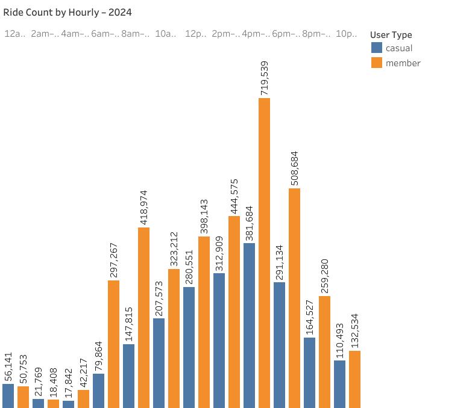

# Cyclistic Case Study

This portfolio project explores usage data from the fictional Cyclistic bike-share company based in Chicago. The primary objective was to identify behavioral trends in how casual and annual members use the service, and to provide data-driven recommendations for converting more casual riders into annual members.

Using Excel for data cleaning, SQL for analysis and formatting data tables, and Tableau for visualization, I followed the six-step data analysis process taught in the Google Data Analytics Certificate to uncover actionable business insights.

** Business Task

Cyclistic is a bike-share program in Chicago, operated by a fictional company created for this case study. The director of marketing believes that increasing annual membership will be key to future profitability. 

To support this goal, the team wants to better understand how casual riders and annual members use the service differently. This will help guide future marketing strategies to convert casual riders into annual members.

*** Key question: ***

> How do annual members and casual riders use Cyclistic bikes differently?

As a junior data analyst, I was tasked with preparing, processing, analyzing, and sharing insights from 12 months of ride data to answer this question and help inform strategic recommendations.

## Data Overview

The data used in this project consists of 12 months of Cyclistic historical trip data from January to December 2024. The data is made publicly available by Motivate International Inc., which runs the Divvy bike-share system in Chicago.

The data included over 5 million ride records in CSV format, each detailing:
- Ride ID
- Rider/User type (casual or member)
- Start and end time
- Start and end stations
- Start and end latitude and longitude
- Bike type
- Ride duration

I combined these datasets into a single file for analysis, resulting in a data table with over 5 million rows.

### Data Cleaning Process:

Using Microsoft Excel and SQL, following best practices from the Google Data Analytics Certificate:
- I removed duplicates and irrelevant fields (e.g., latitude/longitude not used in this project)
- Converted time columns into usable datetime formats
- Created new columns for weekday, hour, season, and ride length
- Filtered out rows with corrupted start and end time data (e.g., start time was after end time)
- Placed nulls in missing station information (not relevant information for this particular analysis)

These transformations enabled consistent analysis across all time periods and user types.

## Analysis: The Six-Step Data Analysis Process

This project followed the six-step data analysis process introduced in the Google Data Analytics Certificate:

### 1. Ask

**Business Task:**  
Determine how casual riders and annual members use Cyclistic bikes differently, with the goal of converting more casual riders into members.

**Guiding Questions:**
- What are the usage patterns of members vs. casual riders?
- When do they ride (time of day, day of week, season)?
- How long are their rides?
- Are there any behavioral trends that marketing can act on?

### 2. Prepare

- **Source:** 12 separate CSV files from Divvy/Cyclistic ride data (Jan–Dec 2024)
- **Access Method:** Downloaded from [Divvy Data Portal](https://divvybikes.com/system-data) *(for realism; not a real Cyclistic portal)*
- Data included fields for user type, start/end times, bike types, station names, and more.
- Combined all files into one master dataset for a full-year view (this was done in MySQL as there were over 5 million records, and it was easier).

### 3. Process

- Cleaned data using **Microsoft Excel**
  - Removed corrupted records where start time was after the recorded end time
  - Retained records with missing station data by replacing values with nulls, as these fields were not critical to this analysis.
  - Ensured consistent datetime formats and data type settings (e.g., number formats instead of text where required)
  - Filtered out rides under 1 minute or with invalid station data
- Added calculated columns:
  - `ride_length_mins` (ride length in minutes)
  - `day_of_week` (numerical format, where 1 = Sunday and 7 = Saturday)
  - `date` (simple date format, dd-mm-yyyy)
  - `time` (standard time format, hh:mm:ss)
  - `hour_block` (more simple representation of the time, e.g. 3 am)
- Used **SQL (MySQL)** to
  - Remove duplicates spanning across months
  - Separated `user_type` results into two tables, using CREATE TABLE, dividing out between member and casual user to reduce query times
  - Create more specific columns to help explore ride behaviors across time and rider type:
    - `month_name` (text representation of the month)
    - `month_num` (numerical representation of the month)
    - `season` (Assigned a season based on the `month_num` value, using a CASE statement)
    - `week_day` (Converted the `day_of_week` to a text representation instead for visualization purposes)
    - `blocked_hours`	(To save time and visualization spacing I grouped the `hour_block` information into two-hourly blocks, e.g. '12 am' and '1 am' became '12am - 2am')

### 4. Analyze

Using **SQL and Tableau**, I examined:
- Average, median and maximum ride lengths
- Ride frequency by season, month, weekday and hour
- Seasonal usage trends
- Comparison of casual vs. member behavior

Also, within this stage, I saved my main findings in new fields I created, which combined all similar records (such as all casual rides on January 1st, 2024, which occured between 7am and 8am):
- `ride_count` (the number of rides)
- `avg_ride_length` (the average ride length in minutes)
- `max_ride_length` (the maximum ride length in minutes)

Key comparisons were broken down by:
- **User Type** (`member` vs `casual`)
- **Ride Duration**
- **Time of Day** and **Day of Week**
- **Month** and **Season**

I concluded the analysis phase by combining the casual and member user tables using a UNION ALL query. This produced a summary table that included only the essential fields required to answer the business question through visual storytelling in Tableau. 

The chosen fields were:
- `user_type`, `season`, `month_name`, `month_num`, `week_day`, `day_of_week`, `hour_block`, `blocked_hours`, `ride_count`, `avg_ride_length`, `max_ride_length`

Additional Exploration:

Further inspection of ride frequency by time block and day revealed a significant spike in casual rider activity during late-night and early morning hours on weekends — particularly between 12 AM and 4 AM on Saturdays and Sundays.

This trend suggests two likely user profiles:

- **Late-shift workers** (e.g., hospitality or fast-food employees) using bikes for affordability and availability.
- **Social riders** returning from nightlife activities, where traditional public transit options are unavailable or infrequent.

While anonymized data limits confirmation, this behavioral pattern warrants deeper investigation. In the meantime, targeted marketing or promotions could be explored for these unique time windows.

### 5. Share

## Supporting Files

- [Full SQL Query Sheet](supporting_files/sql_queries.sql)
- [Cleaned Aggregated Dataset (UNION ALL)](supporting_files/Cyclistic_Data_for_Visualisation.csv)
- Chart Visuals in [Images Folder](supporting_files/images/)

To clearly communicate findings, I built an **interactive dashboard in Tableau** and structured this portfolio on GitHub.

To explore the full dashboard:
[View on Tableau Public](https://public.tableau.com/views/CyclisticPortfolioProject-Draft/Dashboard1?:language=en-US&:sid=&:redirect=auth&:display_count=n&:origin=viz_share_link)

Note: While the dataset includes ride types (e.g., classic, electric, docked), analysis showed minimal variation in usage between user groups based on ride type or maximum ride length. Therefore, these dimensions were excluded from the final dashboard to maintain clarity and relevance.

### 6. Act

Based on the findings, actionable recommendations were developed for the Cyclistic marketing team (see next section).

---

## Key Insights & Visualizations

Below is a summary of the most important insights identified through data analysis:

---

### 1. **Ride Length Differences**

- **Casual riders** take longer rides on average (approx. 35 minutes) compared to **members** (approx. 15 minutes).
- Median values show a more accurate representation of "typical" behavior, as some rides were extreme outliers.

### 2. **Day of Week Patterns**

- **Members** ride consistently throughout the workweek.
- **Casual riders** are much more active on **weekends**, particularly Saturdays and Sundays.

### 3. **Seasonal Trends**

- Casual usage **spikes in summer months** (June–August), with lower activity in winter.
- Member usage remains **more stable** throughout the year, showing consistent utility.

### 4. **Time of Day**

- Members show high usage during **commute hours** (7–9 AM, 4–6 PM).
- Casual riders often ride during **midday and early afternoon** (10 AM–4 PM), likely for leisure.

Late-night spikes (particularly between 12 AM and 4 AM) were observed for casual riders on weekends. These may reflect a combination of shift work and late social outings. This unique behavioral segment is visualized below.

*Figure: Casual user ride count by hour block on weekends*

### Visuals

These insights were visualized using Tableau to make them easier to interpret and explore:

> Full interactive dashboard: [View on Tableau Public](https://public.tableau.com/views/CyclisticPortfolioProject-Draft/Dashboard1?:language=en-US&:sid=&:redirect=auth&:display_count=n&:origin=viz_share_link)

## Recommendations

Based on the analysis of Cyclistic's ride data, the following strategies are recommended to increase the conversion of casual riders to annual members:

1. **Weekend Membership Promotions**: Casual riders predominantly use bikes on weekends. Introducing weekend-focused membership deals could incentivize these users to consider annual memberships.

2. **Targeted Marketing During Peak Casual Usage Hours**: Data indicates that casual riders often ride during midday hours. Deploying targeted ads or promotions during these times could effectively reach this audience.

3. **Highlight Cost Savings**: Emphasize the cost benefits of annual memberships over multiple single rides, especially for users who ride frequently.

4. **Enhanced User Experience**: Improve app features to make the transition from casual to member seamless, such as one-click upgrades or personalized ride summaries showing potential savings.

5. **Explore Off-Hours Membership Incentives**: The late-night usage trend suggests a previously untapped segment of social and shift-worker casual users. Offering discounted off-peak memberships or night/weekend passes could increase sign-ups from this group.

Implementing these strategies could lead to increased membership sign-ups and enhanced customer loyalty.

These data-driven strategies are designed to align with Cyclistic’s goal of converting casual users into long-term members. By focusing on user behavior trends — particularly timing, ride duration, and seasonal patterns — Cyclistic can deploy more targeted and cost-effective marketing initiatives.

## Tools Used

- **Microsoft Excel**: Utilized for initial data cleaning, transformation, and exploratory analysis.
- **MySQL**: Employed for combining, further data cleaning and querying large datasets to extract meaningful patterns and insights.
- **Tableau Public**: Created interactive dashboards to visualize data trends and support findings.
- **GitHub**: Hosted the project repository, including documentation and code, for version control and collaboration.

## Tools Used

- **Microsoft Excel**: Utilized for initial data cleaning, transformation, and exploratory analysis.
- **SQL**: Employed for combining, further data cleaning and querying large datasets to extract meaningful patterns and insights.
- **Tableau Public**: Created interactive dashboards to visualize data trends and support findings.
- **GitHub**: Hosted the project repository, including documentation and code, for version control and collaboration.

## Data Source & Acknowledgment

The data utilized in this project is provided by the City of Chicago and Divvy, operated by Lyft Bikes and Scooters, LLC. The dataset is publicly available and is governed by the Divvy Bikes Data License Agreement.

License Summary:

- Non-exclusive, royalty-free, limited, perpetual license for lawful use.
- Permitted to access, reproduce, analyze, copy, modify, and distribute the data.

Restrictions:
- Do not use the data unlawfully.
- Do not host, stream, publish, distribute, sublicense, or sell the data as a standalone dataset.
- Do not imply affiliation, approval, endorsement, or sponsorship by Divvy or the City of Chicago.
- Do not use trademarks or trade names of Lyft Bikes and Scooters, LLC, the City of Chicago, or any sponsor of the Divvy service without written permission.
- 
Tis project complies with the terms of the license by using the data solely for educational and analytical purposes, without any commercial intent.

## What I Learned

This project was an excellent opportunity to apply the full data analysis process end to end — from cleaning and transforming raw data to uncovering insights and presenting them through an interactive dashboard. It deepened my experience with:

- Handling large datasets using SQL and Excel
- Structuring data for meaningful visualizations in Tableau
- Applying critical thinking to convert findings into business recommendations
- Writing clear, concise documentation using GitHub and Markdown

I also developed a stronger appreciation for the role of data storytelling in making analytics accessible and actionable for decision-makers.
